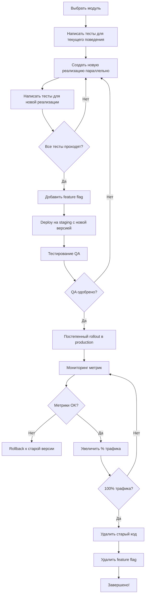

# План рефакторинга кодовой базы к Clean Code

**Дата создания:** 2025-10-21
**Статус:** В планировании
**Цель:** Привести кодовую базу к стандартам Clean Code без нарушения работоспособности

---

## 📋 Оглавление

1. [Анализ текущего состояния](#анализ-текущего-состояния)
2. [Принципы безопасного рефакторинга](#принципы-безопасного-рефакторинга)
3. [Фазы рефакторинга](#фазы-рефакторинга)
4. [Детальный план действий](#детальный-план-действий)
5. [Паттерны и best practices](#паттерны-и-best-practices)
6. [Чеклисты и валидация](#чеклисты-и-валидация)

---

## 🔍 Анализ текущего состояния

### Backend - Критичные проблемы

#### 1. Дублирование кода (CRITICAL)

**Файл:** `backend/controllers/appointmentController.js`

**Проблема:** Полное дублирование функций (строки 1-68 и 68-336)
```javascript
// Строка 1: const db = require('../dbSingleton');
// Строка 68: const db = require('../dbSingleton'); // ДУБЛИКАТ!
// Обе версии createAppointment и getAppointmentsForUser дублируются
```

**Риск:**
- Функция переопределяется дважды (вторая версия побеждает)
- Разный код в двух версиях (одна использует `db.execute`, другая `connection.query`)
- Разные статусы ('scheduled' vs 'pending')

**Решение:** Удалить дубликат, оставить консистентную версию

---

#### 2. Спагетти-код в Routes (HIGH)

**Файл:** `backend/routes/appointments.js` (531 строка)

**Проблема:** Вся бизнес-логика находится в route handlers
```javascript
// В роуте 531 строка кода:
// - Валидация
// - Бизнес-логика
// - SQL запросы
// - Email отправка
// - Error handling
```

**Последствия:**
- Невозможность переиспользования логики
- Сложность тестирования
- Нарушение Single Responsibility Principle
- Дублирование кода между routes

**Решение:** Разделение на слои (Route → Controller → Service → Repository)

---

#### 3. Отсутствие централизованной валидации

**Проблема:** Валидация дублируется в каждом route
```javascript
// В appointments.js, строки 11-28
const errors = {};
if (!businessId || isNaN(parseInt(businessId))) {
  errors.businessId = "Valid business ID is required...";
}
// ... повторяется в 5+ местах
```

**Решение:** Middleware для валидации (express-validator или Joi)

---

#### 4. Security Issues

**Файл:** `backend/routes/cleanup.js`

**Проблема:** Опасные операции без авторизации
```javascript
// Удаление файлов доступно без проверки прав!
router.post('/cleanup/files', async (req, res) => {
  // Нет middleware проверки auth/admin
  fs.unlinkSync(filePath); // Синхронная операция!
});
```

**Риск:** Любой может удалять файлы системы

**Решение:** Добавить auth + admin middleware

---

#### 5. Console.log в продакшене

**Проблема:** 132 вхождения `console.log` в коде
```javascript
console.log('Creating appointment with data:', req.body); // Строка 6
console.log('Database timezone info:', timezoneCheck[0]); // Строка 59
```

**Последствия:**
- Утечка чувствительных данных в логи
- Performance overhead
- Засорение логов

**Решение:** Централизованный logger (Winston/Pino)

---

#### 6. Пустой контроллер

**Файл:** `backend/controllers/reviewController.js` (пустой!)

**Проблема:** Вся логика reviews находится в `routes/reviews.js` (417 строк)

**Решение:** Переместить логику в контроллер

---

### Frontend - Проблемы кода

#### 1. Большие компоненты (God Components)

**Файлы:**
- `BusinessRegistration.jsx` - 509 строк
- `BusinessEditPage.jsx` - 505 строк
- `BookingForm.jsx` - 432 строки
- `SearchPage.jsx` - 430 строк

**Проблема:** Множественные ответственности в одном компоненте
```javascript
// В BookingForm.jsx:
// - UI рендеринг (форма)
// - Валидация
// - State management
// - API запросы
// - Error handling
// - Auto-fill логика
```

**Решение:** Разделение на меньшие компоненты + custom hooks

---

#### 2. Дублирование API вызовов

**Проблема:** Каждый компонент делает свои fetch/axios вызовы
```javascript
// В 15+ компонентах:
const fetchBusinessData = async () => {
  try {
    const response = await axiosInstance.get(`/api/businesses/${id}`);
    setData(response.data);
  } catch (error) {
    setError(error.message);
  }
};
```

**Решение:** API service layer + React Query для кэширования

---

#### 3. Смешанные concerns

**Пример:** `BusinessProfile/api/appointments.js`
```javascript
// Использует fetch вместо axiosInstance!
export async function fetchAppointments(businessId, monthIso) {
  const response = await fetch(...); // Нет JWT токена!
}
```

**Проблема:** Обходит глобальные interceptors

**Решение:** Использовать единый API client

---

#### 4. Отсутствие констант

**Проблема:** Magic strings и numbers по всему коду
```javascript
if (daysDiff > 30) { // Что такое 30?
if (hoursDiff > 24) { // Что такое 24?
status === 'pending' // Hardcoded string
```

**Решение:** Централизованные константы

---

### Метрики качества кода

```
Backend Routes:
├── appointments.js: 531 строк ⚠️
├── users.js: 435 строк ⚠️
├── reviews.js: 417 строк ⚠️
└── admin.js: 331 строка ⚠️

Frontend Components:
├── BusinessRegistration.jsx: 509 строк ⚠️
├── BusinessEditPage.jsx: 505 строк ⚠️
├── BookingForm.jsx: 432 строки ⚠️
└── SearchPage.jsx: 430 строк ⚠️

Code Smells:
├── console.log: 132 вхождения
├── Дублированный код: appointmentController.js
├── Dead code: reviewController.js (empty)
└── Magic numbers/strings: 50+ мест
```

---

## 🛡️ Принципы безопасного рефакторинга

### Золотые правила

1. **НЕ ломать существующий API контракт**
   - Сохранить все существующие endpoints
   - Сохранить форматы request/response
   - Только внутренние изменения

2. **Incremental changes (постепенность)**
   - Один модуль за раз
   - Малые, атомарные коммиты
   - Регрессионное тестирование после каждого шага

3. **Strangler Fig Pattern**
   - Новый код живет рядом со старым
   - Постепенная миграция
   - Удаление старого кода только после проверки

4. **Тестирование на каждом шаге**
   - Запуск существующих тестов
   - Добавление новых тестов
   - Ручное тестирование критичных путей

### Стратегия внедрения

#### Подход 1: Parallel Implementation (для критичного кода)

```javascript
// Шаг 1: Создать новую функцию рядом со старой
async function createAppointment_NEW(req, res) {
  // новая чистая реализация
}

// Шаг 2: Добавить feature flag
if (process.env.USE_NEW_APPOINTMENTS === 'true') {
  return createAppointment_NEW(req, res);
}
return createAppointment_OLD(req, res); // старая версия

// Шаг 3: Постепенное включение в production
// Шаг 4: После проверки - удалить старый код
```

#### Подход 2: Extract and Replace (для рефакторинга)

```javascript
// Было:
router.post('/appointments', async (req, res) => {
  // 200 строк кода здесь
});

// Шаг 1: Извлечь в функцию (не меняя логику!)
async function handleCreateAppointment(req, res) {
  // те же 200 строк
}
router.post('/appointments', handleCreateAppointment);

// Шаг 2: Переместить в controller
router.post('/appointments', appointmentController.create);

// Шаг 3: Разбить controller на service/repository
```

#### Подход 3: Branch by Abstraction

```javascript
// Шаг 1: Создать интерфейс (абстракцию)
class AppointmentService {
  async create(data) { /* ... */ }
}

// Шаг 2: Старая реализация
class LegacyAppointmentService extends AppointmentService {
  async create(data) { /* старый код */ }
}

// Шаг 3: Новая реализация
class ModernAppointmentService extends AppointmentService {
  async create(data) { /* новый код */ }
}

// Шаг 4: Переключение
const service = USE_NEW ? new ModernAppointmentService() : new LegacyAppointmentService();
```

---

## 🚀 Фазы рефакторинга

### ФАЗА 0: Подготовка (1-2 дня)

**Цель:** Создать инфраструктуру для безопасного рефакторинга

**Задачи:**
- [ ] Настроить ESLint/Prettier с правилами
- [ ] Добавить pre-commit hooks (Husky + lint-staged)
- [ ] Создать branch protection rules
- [ ] Документировать текущее API (Postman/Swagger)
- [ ] Создать smoke tests для критичных путей
- [ ] Настроить CI/CD для автоматических тестов

**Инструменты:**
```json
{
  "eslint": "^8.0.0",
  "prettier": "^3.0.0",
  "husky": "^8.0.0",
  "lint-staged": "^15.0.0",
  "jest": "^29.0.0"
}
```

**Критерии готовности:**
- ✅ Все существующие тесты проходят
- ✅ ESLint rules применены (warnings ok, no errors)
- ✅ Git hooks работают
- ✅ Документация API актуальна

---

### ФАЗА 1: Критичные баги (2-3 дня)

**Приоритет:** CRITICAL
**Риск:** LOW (чистка, не изменение логики)

#### 1.1 Исправить дублирование в appointmentController.js

**Файл:** `backend/controllers/appointmentController.js`

**Действия:**
1. ✅ **Анализ:** Определить какая версия используется routes
2. ✅ **Резервная копия:** Создать branch `fix/appointment-controller-duplicate`
3. ✅ **Удалить:** Вторую копию функций (строки 68-336)
4. ✅ **Проверить:** Что осталась рабочая версия
5. ✅ **Тест:** Запустить существующие тесты
6. ✅ **Smoke test:** Ручная проверка создания appointment

**Безопасность:**
```bash
# Перед изменением
git checkout -b fix/appointment-controller-duplicate
cp backend/controllers/appointmentController.js backend/controllers/appointmentController.js.backup

# После изменения - проверка
npm test
# Ручной тест: создать appointment через UI

# Если ОК:
git commit -m "fix: remove duplicate code in appointmentController"
# Если НЕ ОК:
git checkout appointmentController.js # откатить
```

---

#### 1.2 Создать authentication middleware

**Новый файл:** `backend/middleware/auth.js`

**Действия:**
1. ✅ **Создать:** Middleware для проверки JWT
2. ✅ **Не трогать:** Существующие routes (пока)
3. ✅ **Тестировать:** На новом тестовом endpoint

**Реализация:**
```javascript
// backend/middleware/auth.js
const jwt = require('jsonwebtoken');

/**
 * Проверяет наличие и валидность JWT токена
 * Добавляет user в req.user
 */
const authenticate = (req, res, next) => {
  try {
    const token = req.headers.authorization?.split(' ')[1];

    if (!token) {
      return res.status(401).json({
        error: 'Authentication required / נדרשת אימות'
      });
    }

    const decoded = jwt.verify(token, process.env.JWT_SECRET);
    req.user = decoded; // { userId, role, email }
    next();
  } catch (error) {
    return res.status(401).json({
      error: 'Invalid token / טוקן לא תקף'
    });
  }
};

/**
 * Проверяет, что пользователь имеет нужную роль
 */
const authorize = (...roles) => {
  return (req, res, next) => {
    if (!req.user) {
      return res.status(401).json({ error: 'Authentication required' });
    }

    if (!roles.includes(req.user.role)) {
      return res.status(403).json({
        error: 'Insufficient permissions / אין הרשאות מספיקות'
      });
    }

    next();
  };
};

module.exports = { authenticate, authorize };
```

**Тестирование middleware:**
```javascript
// backend/tests/middleware/auth.test.js
describe('Auth Middleware', () => {
  test('authenticate - should reject request without token', () => {
    // ...
  });

  test('authenticate - should accept valid token', () => {
    // ...
  });

  test('authorize - should check user role', () => {
    // ...
  });
});
```

---

#### 1.3 Добавить авторизацию в cleanup routes

**Файл:** `backend/routes/cleanup.js`

**ВАЖНО:** Это опасный endpoint - требует немедленной защиты!

**Действия:**
1. ✅ **Импортировать:** Auth middleware
2. ✅ **Применить:** К всем routes в cleanup.js
3. ✅ **Проверить:** Что unauthorized users получают 401/403
4. ✅ **Документировать:** Требование admin role

**Безопасное внедрение:**
```javascript
// backend/routes/cleanup.js
const express = require("express");
const router = express.Router();
const { authenticate, authorize } = require('../middleware/auth'); // НОВОЕ

// ПРИМЕНИТЬ КО ВСЕМ ROUTES В ФАЙЛЕ
router.use(authenticate); // Все routes требуют auth
router.use(authorize('admin')); // Только admin

// Существующие routes остаются без изменений
router.post('/cleanup/files', async (req, res) => {
  // та же логика
});

module.exports = router;
```

**Тестирование:**
```bash
# Тест 1: Без токена (должен вернуть 401)
curl -X POST http://localhost:3030/api/cleanup/files

# Тест 2: С customer токеном (должен вернуть 403)
curl -X POST http://localhost:3030/api/cleanup/files \
  -H "Authorization: Bearer <customer_token>"

# Тест 3: С admin токеном (должен работать)
curl -X POST http://localhost:3030/api/cleanup/files \
  -H "Authorization: Bearer <admin_token>"
```

---

#### 1.4 Заменить console.log на logger

**Новый файл:** `backend/utils/logger.js`

**Действия:**
1. ✅ **Создать:** Winston logger с уровнями
2. ✅ **Не удалять console.log сразу!**
3. ✅ **Добавить logger рядом с console.log**
4. ✅ **Постепенно заменять:** По одному файлу

**Реализация:**
```javascript
// backend/utils/logger.js
const winston = require('winston');
const path = require('path');

const logger = winston.createLogger({
  level: process.env.LOG_LEVEL || 'info',
  format: winston.format.combine(
    winston.format.timestamp(),
    winston.format.errors({ stack: true }),
    winston.format.json()
  ),
  defaultMeta: { service: 'appointment-api' },
  transports: [
    // Errors в отдельный файл
    new winston.transports.File({
      filename: path.join('logs', 'error.log'),
      level: 'error'
    }),
    // Все логи
    new winston.transports.File({
      filename: path.join('logs', 'combined.log')
    }),
  ],
});

// В development - также в консоль
if (process.env.NODE_ENV !== 'production') {
  logger.add(new winston.transports.Console({
    format: winston.format.simple(),
  }));
}

module.exports = logger;
```

**Постепенная миграция:**
```javascript
// Было:
console.log('Creating appointment with data:', req.body);

// Переходный период (оба работают):
console.log('Creating appointment with data:', req.body); // TODO: remove
logger.info('Creating appointment', {
  userId: req.user?.userId,
  businessId: req.body.businessId
});

// Финально (после проверки):
logger.info('Creating appointment', {
  userId: req.user?.userId,
  businessId: req.body.businessId
});
```

**План миграции:**
- Week 1: Добавить logger во все новые файлы
- Week 2: Заменить в критичных файлах (auth, appointments)
- Week 3: Заменить в остальных файлах
- Week 4: Удалить все console.log

---

### ФАЗА 2: Backend - Separation of Concerns (1-2 недели)

**Приоритет:** HIGH
**Цель:** Разделить код на слои (Routes → Controllers → Services → Repositories)

#### 2.1 Архитектура слоев

**Новая структура:**
```
backend/
├── routes/           # Маршрутизация, минимальная логика
├── controllers/      # Обработка HTTP, валидация DTO
├── services/         # Бизнес-логика
├── repositories/     # Работа с БД
├── middleware/       # Auth, validation, error handling
├── validators/       # Схемы валидации (Joi)
├── dto/             # Data Transfer Objects
├── utils/           # Вспомогательные функции
└── config/          # Конфигурация
```

**Пример потока запроса:**
```
Request
  → Route (routing only)
  → Middleware (auth, validation)
  → Controller (HTTP handling, DTO mapping)
  → Service (business logic)
  → Repository (database operations)
  → Response
```

---

#### 2.2 Рефакторинг Appointments Module

**Это самый большой и сложный модуль - будем делать постепенно!**

##### Шаг 2.2.1: Создать Repository Layer

**Новый файл:** `backend/repositories/appointmentRepository.js`

**Задача:** Инкапсулировать все SQL запросы

```javascript
// backend/repositories/appointmentRepository.js
const db = require('../dbSingleton').getPromise();

class AppointmentRepository {
  /**
   * Найти appointment по ID
   */
  async findById(appointmentId) {
    const [rows] = await db.query(
      `SELECT * FROM appointments WHERE appointment_id = ?`,
      [appointmentId]
    );
    return rows[0] || null;
  }

  /**
   * Найти appointments по business_id и месяцу
   */
  async findByBusinessAndMonth(businessId, month, status = null) {
    let sql = `
      SELECT a.appointment_id, a.customer_id, a.service_id, a.business_id,
             DATE(a.appointment_datetime) AS date,
             TIME_FORMAT(a.appointment_datetime,'%H:%i') AS time,
             a.appointment_datetime,
             a.status, a.notes,
             COALESCE(u.first_name, 'לקוח') AS first_name,
             COALESCE(u.last_name, 'לא ידוע') AS last_name,
             COALESCE(u.phone, '') AS customer_phone,
             COALESCE(s.name, 'שירות לא ידוע') AS service_name,
             COALESCE(s.price, 0) AS price,
             COALESCE(s.duration_minutes, 0) AS duration_minutes
        FROM appointments a
        LEFT JOIN users u ON a.customer_id = u.user_id
        LEFT JOIN services s ON a.service_id = s.service_id AND s.business_id = a.business_id
       WHERE a.business_id = ?
         AND DATE_FORMAT(a.appointment_datetime,'%Y-%m') = ?
    `;

    const params = [businessId, month];

    if (status) {
      sql += " AND a.status = ?";
      params.push(status);
    }

    const [rows] = await db.query(sql, params);
    return rows;
  }

  /**
   * Проверить существование appointment в указанное время
   */
  async existsAtDateTime(businessId, datetime, excludeAppointmentId = null) {
    let sql = `
      SELECT appointment_id FROM appointments
      WHERE business_id = ?
        AND appointment_datetime = ?
        AND status != 'cancelled'
    `;
    const params = [businessId, datetime];

    if (excludeAppointmentId) {
      sql += " AND appointment_id != ?";
      params.push(excludeAppointmentId);
    }

    const [rows] = await db.query(sql, params);
    return rows.length > 0;
  }

  /**
   * Создать новый appointment
   */
  async create(data) {
    const {
      customerId,
      businessId,
      serviceId,
      appointmentDatetime,
      notes,
      status = 'pending'
    } = data;

    const [result] = await db.query(
      `INSERT INTO appointments
       (customer_id, business_id, service_id, appointment_datetime, status, notes, created_at)
       VALUES (?, ?, ?, ?, ?, ?, NOW())`,
      [customerId, businessId, serviceId, appointmentDatetime, status, notes || null]
    );

    return {
      appointmentId: result.insertId,
      ...data
    };
  }

  /**
   * Обновить datetime appointment
   */
  async updateDateTime(appointmentId, appointmentDatetime) {
    const [result] = await db.query(
      `UPDATE appointments SET appointment_datetime = ? WHERE appointment_id = ?`,
      [appointmentDatetime, appointmentId]
    );

    return result.affectedRows > 0;
  }

  /**
   * Обновить статус appointment
   */
  async updateStatus(appointmentId, status) {
    const [result] = await db.query(
      `UPDATE appointments SET status = ? WHERE appointment_id = ?`,
      [status, appointmentId]
    );

    return result.affectedRows > 0;
  }

  /**
   * Получить appointments пользователя
   */
  async findByCustomer(customerId, filters = {}) {
    const { type } = filters;
    let whereClause = '';

    if (type === 'upcoming') {
      whereClause = "AND status = 'approved' AND appointment_datetime >= NOW()";
    } else if (type === 'past') {
      whereClause = "AND status = 'approved' AND appointment_datetime < NOW()";
    } else if (type === 'canceled') {
      whereClause = "AND status = 'cancelled'";
    }

    const [rows] = await db.query(
      `SELECT a.appointment_id, a.customer_id, a.business_id, a.service_id,
              a.appointment_datetime, a.status, a.notes, a.created_at,
              b.name AS business_name, s.name AS service_name, s.price, s.duration_minutes
       FROM appointments a
       LEFT JOIN businesses b ON a.business_id = b.business_id
       LEFT JOIN services s ON a.service_id = s.service_id
       WHERE a.customer_id = ?
       ${whereClause}
       ORDER BY a.appointment_datetime DESC`,
      [customerId]
    );

    return rows;
  }

  /**
   * Получить детали appointment с бизнесом и сервисом
   */
  async findByIdWithDetails(appointmentId) {
    const [rows] = await db.query(
      `SELECT a.*,
              u.email, u.first_name, u.last_name,
              b.name as business_name, b.location,
              bo.email as owner_email, bo.phone as owner_phone,
              s.name as service_name, s.price
       FROM appointments a
       LEFT JOIN users u ON a.customer_id = u.user_id
       LEFT JOIN businesses b ON a.business_id = b.business_id
       LEFT JOIN users bo ON b.owner_id = bo.user_id
       LEFT JOIN services s ON a.service_id = s.service_id
       WHERE a.appointment_id = ?`,
      [appointmentId]
    );

    return rows[0] || null;
  }
}

module.exports = new AppointmentRepository();
```

**Важно:** Пока НЕ трогаем старый код в routes! Repository живет параллельно.

---

##### Шаг 2.2.2: Создать Service Layer

**Новый файл:** `backend/services/appointmentService.js`

**Задача:** Вся бизнес-логика (валидация доменных правил, оркестрация)

```javascript
// backend/services/appointmentService.js
const appointmentRepository = require('../repositories/appointmentRepository');
const userRepository = require('../repositories/userRepository');
const emailService = require('./emailService');
const logger = require('../utils/logger');

class AppointmentService {
  /**
   * Создать новый appointment
   * Включает: проверку конфликтов, создание клиента, отправку email
   */
  async createAppointment(appointmentData) {
    const {
      businessId,
      serviceId,
      date,
      time,
      firstName,
      lastName,
      phone,
      email,
      notes
    } = appointmentData;

    // 1. Валидация: не в прошлом
    const appointmentDateTime = new Date(`${date}T${time}:00`);
    if (appointmentDateTime < new Date()) {
      throw new ValidationError('Cannot schedule appointment in the past');
    }

    // 2. Проверка конфликтов
    const datetime = `${date} ${time}:00`;
    const hasConflict = await appointmentRepository.existsAtDateTime(
      businessId,
      datetime
    );

    if (hasConflict) {
      throw new ConflictError('This time slot is already booked');
    }

    // 3. Найти или создать клиента
    let customer = await userRepository.findByPhone(phone);

    if (!customer) {
      customer = await userRepository.createCustomer({
        firstName,
        lastName,
        phone,
        email: email || null
      });
    }

    // 4. Создать appointment
    const appointment = await appointmentRepository.create({
      customerId: customer.user_id,
      businessId,
      serviceId,
      appointmentDatetime: datetime,
      notes,
      status: 'pending'
    });

    // 5. Отправить email уведомления (async, не блокируем)
    this._sendBookingEmails(appointment.appointmentId).catch(error => {
      logger.error('Failed to send booking emails', {
        appointmentId: appointment.appointmentId,
        error: error.message
      });
    });

    return appointment;
  }

  /**
   * Получить appointments для бизнеса
   */
  async getBusinessAppointments(businessId, month, status = null) {
    const appointments = await appointmentRepository.findByBusinessAndMonth(
      businessId,
      month,
      status
    );

    // Трансформация в DTO
    return appointments.map(apt => ({
      appointmentId: apt.appointment_id,
      customerId: apt.customer_id,
      serviceId: apt.service_id,
      date: apt.date,
      time: apt.time,
      appointmentDatetime: apt.appointment_datetime,
      status: apt.status,
      notes: apt.notes,
      firstName: apt.first_name,
      lastName: apt.last_name,
      customerName: `${apt.first_name} ${apt.last_name}`,
      customerPhone: apt.customer_phone,
      serviceName: apt.service_name,
      price: apt.price,
      durationMinutes: apt.duration_minutes
    }));
  }

  /**
   * Перенести appointment
   */
  async rescheduleAppointment(appointmentId, newDateTime) {
    // 1. Проверка что appointment существует
    const appointment = await appointmentRepository.findById(appointmentId);
    if (!appointment) {
      throw new NotFoundError('Appointment not found');
    }

    // 2. Валидация: не в прошлом
    if (new Date(newDateTime) < new Date()) {
      throw new ValidationError('Cannot reschedule to past');
    }

    // 3. Проверка конфликтов (исключая текущий appointment)
    const hasConflict = await appointmentRepository.existsAtDateTime(
      appointment.business_id,
      newDateTime,
      appointmentId
    );

    if (hasConflict) {
      throw new ConflictError('Time slot is already booked');
    }

    // 4. Обновить
    await appointmentRepository.updateDateTime(appointmentId, newDateTime);

    // 5. Отправить email (async)
    this._sendRescheduleEmail(appointmentId, appointment.appointment_datetime, newDateTime)
      .catch(error => logger.error('Failed to send reschedule email', { error }));

    return { success: true };
  }

  /**
   * Отменить appointment
   */
  async cancelAppointment(appointmentId) {
    const appointment = await appointmentRepository.findById(appointmentId);
    if (!appointment) {
      throw new NotFoundError('Appointment not found');
    }

    await appointmentRepository.updateStatus(appointmentId, 'cancelled');

    // Email notification (async)
    this._sendCancellationEmail(appointmentId).catch(error =>
      logger.error('Failed to send cancellation email', { error })
    );

    return { success: true };
  }

  /**
   * Изменить статус
   */
  async updateAppointmentStatus(appointmentId, newStatus) {
    const validStatuses = ['pending', 'approved', 'cancelled', 'completed'];
    if (!validStatuses.includes(newStatus)) {
      throw new ValidationError(`Invalid status: ${newStatus}`);
    }

    const appointment = await appointmentRepository.findById(appointmentId);
    if (!appointment) {
      throw new NotFoundError('Appointment not found');
    }

    await appointmentRepository.updateStatus(appointmentId, newStatus);

    // Email notification
    this._sendStatusChangeEmail(appointmentId, appointment.status, newStatus)
      .catch(error => logger.error('Failed to send status change email', { error }));

    return { success: true };
  }

  // Private methods для email отправки
  async _sendBookingEmails(appointmentId) {
    const details = await appointmentRepository.findByIdWithDetails(appointmentId);
    if (!details) return;

    // Customer email
    if (details.email) {
      await emailService.sendBookingConfirmation({
        customerEmail: details.email,
        customerName: `${details.first_name} ${details.last_name}`,
        businessName: details.business_name,
        serviceName: details.service_name,
        appointmentDate: new Date(details.appointment_datetime).toISOString().split('T')[0],
        appointmentTime: new Date(details.appointment_datetime).toTimeString().split(' ')[0].substring(0, 5),
        price: details.price,
        businessPhone: details.owner_phone || '',
        businessAddress: details.location || '',
        notes: details.notes || ''
      });
    }

    // Business owner email
    if (details.owner_email) {
      await emailService.sendBusinessNotification({
        businessEmail: details.owner_email,
        businessName: details.business_name,
        customerName: `${details.first_name} ${details.last_name}`,
        customerPhone: details.phone,
        customerEmail: details.email || '',
        serviceName: details.service_name,
        appointmentDate: new Date(details.appointment_datetime).toISOString().split('T')[0],
        appointmentTime: new Date(details.appointment_datetime).toTimeString().split(' ')[0].substring(0, 5),
        price: details.price,
        notes: details.notes || ''
      });
    }
  }

  async _sendRescheduleEmail(appointmentId, oldDateTime, newDateTime) {
    // Similar implementation
  }

  async _sendCancellationEmail(appointmentId) {
    // Similar implementation
  }

  async _sendStatusChangeEmail(appointmentId, oldStatus, newStatus) {
    // Similar implementation
  }
}

// Custom errors
class ValidationError extends Error {
  constructor(message) {
    super(message);
    this.name = 'ValidationError';
    this.statusCode = 400;
  }
}

class NotFoundError extends Error {
  constructor(message) {
    super(message);
    this.name = 'NotFoundError';
    this.statusCode = 404;
  }
}

class ConflictError extends Error {
  constructor(message) {
    super(message);
    this.name = 'ConflictError';
    this.statusCode = 409;
  }
}

module.exports = new AppointmentService();
```

---

##### Шаг 2.2.3: Создать Controller

**Новый файл:** `backend/controllers/appointmentController.NEW.js`

**Задача:** HTTP handling, DTO mapping, делегирование в Service

```javascript
// backend/controllers/appointmentController.NEW.js
const appointmentService = require('../services/appointmentService');
const logger = require('../utils/logger');

class AppointmentController {
  /**
   * POST /api/appointments
   * Создать новый appointment
   */
  async createAppointment(req, res, next) {
    try {
      const {
        businessId,
        serviceId,
        date,
        time,
        firstName,
        lastName,
        phone,
        email,
        notes
      } = req.body;

      // Валидация уже выполнена middleware
      // Просто передаем в service
      const appointment = await appointmentService.createAppointment({
        businessId: parseInt(businessId),
        serviceId: parseInt(serviceId),
        date,
        time,
        firstName,
        lastName,
        phone,
        email,
        notes
      });

      logger.info('Appointment created', {
        appointmentId: appointment.appointmentId,
        businessId,
        userId: req.user?.userId
      });

      res.status(201).json({
        message: 'Appointment created successfully / תור נוצר בהצלחה',
        appointmentId: appointment.appointmentId
      });

    } catch (error) {
      next(error); // Передаем в error handling middleware
    }
  }

  /**
   * GET /api/appointments?businessId=1&month=2025-05
   */
  async getAppointments(req, res, next) {
    try {
      const { businessId, month, status } = req.query;

      // Валидация выполнена middleware
      const appointments = await appointmentService.getBusinessAppointments(
        parseInt(businessId),
        month,
        status || null
      );

      res.json(appointments);

    } catch (error) {
      next(error);
    }
  }

  /**
   * PUT /api/appointments/:id
   * Перенести appointment
   */
  async rescheduleAppointment(req, res, next) {
    try {
      const { id } = req.params;
      const { appointment_datetime } = req.body;

      await appointmentService.rescheduleAppointment(
        parseInt(id),
        appointment_datetime
      );

      res.json({
        message: 'Appointment updated successfully'
      });

    } catch (error) {
      next(error);
    }
  }

  /**
   * POST /api/appointments/:id/cancel
   */
  async cancelAppointment(req, res, next) {
    try {
      const { id } = req.params;

      await appointmentService.cancelAppointment(parseInt(id));

      res.json({
        message: 'Appointment cancelled successfully'
      });

    } catch (error) {
      next(error);
    }
  }

  /**
   * PUT /api/appointments/:id/status
   */
  async updateStatus(req, res, next) {
    try {
      const { id } = req.params;
      const { status } = req.body;

      await appointmentService.updateAppointmentStatus(
        parseInt(id),
        status
      );

      res.json({
        message: 'Appointment status updated'
      });

    } catch (error) {
      next(error);
    }
  }

  /**
   * GET /api/appointments/user/:userId
   */
  async getUserAppointments(req, res, next) {
    try {
      const { userId } = req.params;
      const { type } = req.query;

      const appointments = await appointmentService.getUserAppointments(
        parseInt(userId),
        { type }
      );

      res.json(appointments);

    } catch (error) {
      next(error);
    }
  }
}

module.exports = new AppointmentController();
```

---

##### Шаг 2.2.4: Создать Validation Middleware

**Новый файл:** `backend/validators/appointmentValidator.js`

**Используем Joi для валидации схем:**

```javascript
// backend/validators/appointmentValidator.js
const Joi = require('joi');

const appointmentSchemas = {
  // Схема для создания appointment
  create: Joi.object({
    businessId: Joi.number().integer().positive().required()
      .messages({
        'number.base': 'Valid business ID is required / נדרש מזהה עסק תקין',
        'number.positive': 'Business ID must be positive',
        'any.required': 'Business ID is required'
      }),

    serviceId: Joi.number().integer().positive().required()
      .messages({
        'number.base': 'Valid service ID is required / נדרש מזהה שירות תקין',
        'any.required': 'Service ID is required'
      }),

    date: Joi.string().pattern(/^\d{4}-\d{2}-\d{2}$/).required()
      .messages({
        'string.pattern.base': 'Date must be in YYYY-MM-DD format / תאריך חייב להיות בפורמט YYYY-MM-DD',
        'any.required': 'Date is required'
      }),

    time: Joi.string().pattern(/^([01]?[0-9]|2[0-3]):[0-5][0-9]$/).required()
      .messages({
        'string.pattern.base': 'Time must be in HH:MM format / שעה חייבת להיות בפורמט HH:MM',
        'any.required': 'Time is required'
      }),

    firstName: Joi.string().min(2).max(50).required()
      .messages({
        'string.min': 'First name must be at least 2 characters',
        'string.max': 'First name cannot exceed 50 characters',
        'any.required': 'First name is required'
      }),

    lastName: Joi.string().min(2).max(50).required(),

    phone: Joi.string().pattern(/^[0-9]{10,15}$/).required()
      .messages({
        'string.pattern.base': 'Phone must be 10-15 digits',
        'any.required': 'Phone is required'
      }),

    email: Joi.string().email().allow(null, '').optional(),

    notes: Joi.string().max(500).allow(null, '').optional()
  }),

  // Схема для query параметров GET /appointments
  getList: Joi.object({
    businessId: Joi.number().integer().positive().required(),
    month: Joi.string().pattern(/^\d{4}-\d{2}$/).required()
      .messages({
        'string.pattern.base': 'Month must be in YYYY-MM format / חודש חייב להיות בפורמט YYYY-MM'
      }),
    status: Joi.string().valid('pending', 'approved', 'cancelled').optional()
  }),

  // Схема для обновления
  update: Joi.object({
    appointment_datetime: Joi.string().pattern(/^\d{4}-\d{2}-\d{2} \d{2}:\d{2}:\d{2}$/).required(),
    business_id: Joi.number().integer().positive().required()
  }),

  // Схема для обновления статуса
  updateStatus: Joi.object({
    status: Joi.string().valid('pending', 'approved', 'cancelled', 'completed').required()
  })
};

/**
 * Middleware factory для валидации
 */
const validate = (schema, source = 'body') => {
  return (req, res, next) => {
    const data = source === 'query' ? req.query : req.body;

    const { error, value } = schema.validate(data, {
      abortEarly: false, // Вернуть все ошибки, не только первую
      stripUnknown: true // Удалить неизвестные поля
    });

    if (error) {
      const errors = {};
      error.details.forEach(detail => {
        errors[detail.path[0]] = detail.message;
      });

      return res.status(400).json({ errors });
    }

    // Заменить данные валидированными (уже type-casted)
    if (source === 'query') {
      req.query = value;
    } else {
      req.body = value;
    }

    next();
  };
};

module.exports = {
  validateCreate: validate(appointmentSchemas.create, 'body'),
  validateGetList: validate(appointmentSchemas.getList, 'query'),
  validateUpdate: validate(appointmentSchemas.update, 'body'),
  validateUpdateStatus: validate(appointmentSchemas.updateStatus, 'body')
};
```

---

##### Шаг 2.2.5: Обновить Routes (новая версия параллельно)

**Новый файл:** `backend/routes/appointments.NEW.js`

**Минимальный код - только routing:**

```javascript
// backend/routes/appointments.NEW.js
const express = require('express');
const router = express.Router();
const appointmentController = require('../controllers/appointmentController.NEW');
const { authenticate, authorize } = require('../middleware/auth');
const {
  validateCreate,
  validateGetList,
  validateUpdate,
  validateUpdateStatus
} = require('../validators/appointmentValidator');

/**
 * GET /api/appointments?businessId=1&month=2025-05&status=pending
 * Получить appointments для бизнеса
 * Требуется: authentication
 */
router.get('/',
  authenticate,
  validateGetList,
  appointmentController.getAppointments
);

/**
 * POST /api/appointments
 * Создать новый appointment
 * Публичный endpoint (customer может не быть залогинен)
 */
router.post('/',
  validateCreate,
  appointmentController.createAppointment
);

/**
 * PUT /api/appointments/:id
 * Перенести appointment
 * Требуется: authentication
 */
router.put('/:id',
  authenticate,
  validateUpdate,
  appointmentController.rescheduleAppointment
);

/**
 * POST /api/appointments/:id/cancel
 * Отменить appointment
 * Требуется: authentication
 */
router.post('/:id/cancel',
  authenticate,
  appointmentController.cancelAppointment
);

/**
 * GET /api/appointments/user/:userId
 * Получить appointments пользователя
 * Требуется: authentication (только свои appointments)
 */
router.get('/user/:userId',
  authenticate,
  // TODO: добавить middleware проверки что userId === req.user.userId
  appointmentController.getUserAppointments
);

/**
 * PUT /api/appointments/:id/status
 * Обновить статус
 * Требуется: business_owner or admin
 */
router.put('/:id/status',
  authenticate,
  authorize('business_owner', 'admin'),
  validateUpdateStatus,
  appointmentController.updateStatus
);

module.exports = router;
```

**Видите разницу?**
- Было: 531 строка логики в route
- Стало: ~70 строк чистого routing

---

##### Шаг 2.2.6: Постепенное внедрение

**ВАЖНО: Не удаляем старый код сразу!**

**План миграции:**

1. **Week 1:** Создать новые файлы (Repository, Service, Controller, Routes.NEW)
2. **Week 2:** Добавить feature flag в app.js
3. **Week 3:** Тестирование новой версии на staging
4. **Week 4:** Постепенное переключение в production (10% → 50% → 100%)
5. **Week 5:** Удаление старого кода

**Feature flag в app.js:**

```javascript
// backend/src/app.js
const express = require('express');
const app = express();

// Feature flag
const USE_NEW_APPOINTMENTS = process.env.USE_NEW_APPOINTMENTS === 'true';

// Роуты
if (USE_NEW_APPOINTMENTS) {
  console.log('Using NEW appointments implementation');
  app.use('/api/appointments', require('../routes/appointments.NEW'));
} else {
  console.log('Using LEGACY appointments implementation');
  app.use('/api/appointments', require('../routes/appointments'));
}

// Остальные routes...
```

**Тестирование:**

```bash
# 1. Запустить с новой версией
USE_NEW_APPOINTMENTS=true npm start

# 2. Запустить все тесты
npm test

# 3. Ручное тестирование
# - Создать appointment
# - Получить список
# - Обновить
# - Отменить

# 4. Сравнить поведение со старой версией
USE_NEW_APPOINTMENTS=false npm start
# Повторить тесты

# 5. Если всё ОК - удалить старый код
```

---

#### 2.3 Error Handling Middleware

**Новый файл:** `backend/middleware/errorHandler.js`

**Централизованная обработка ошибок:**

```javascript
// backend/middleware/errorHandler.js
const logger = require('../utils/logger');

/**
 * Централизованный обработчик ошибок
 * Должен быть последним middleware в app.js
 */
const errorHandler = (err, req, res, next) => {
  // Логирование ошибки
  logger.error('Error occurred', {
    error: err.message,
    stack: err.stack,
    path: req.path,
    method: req.method,
    userId: req.user?.userId,
    body: req.body
  });

  // Определение статус кода
  let statusCode = err.statusCode || 500;
  let message = err.message || 'Internal Server Error';

  // Специальная обработка известных типов ошибок
  if (err.name === 'ValidationError') {
    statusCode = 400;
  } else if (err.name === 'NotFoundError') {
    statusCode = 404;
  } else if (err.name === 'ConflictError') {
    statusCode = 409;
  } else if (err.name === 'UnauthorizedError' || err.name === 'JsonWebTokenError') {
    statusCode = 401;
    message = 'Invalid or expired token / טוקן לא תקף';
  } else if (err.name === 'ForbiddenError') {
    statusCode = 403;
    message = 'Insufficient permissions / אין הרשאות מספיקות';
  }

  // В production не возвращаем stack trace
  const response = {
    error: message,
    ...(process.env.NODE_ENV === 'development' && { stack: err.stack })
  };

  // Если есть errors объект (из валидации)
  if (err.errors) {
    response.errors = err.errors;
  }

  res.status(statusCode).json(response);
};

/**
 * Обработчик для 404 (route not found)
 */
const notFoundHandler = (req, res) => {
  res.status(404).json({
    error: `Route not found: ${req.method} ${req.path}`
  });
};

module.exports = {
  errorHandler,
  notFoundHandler
};
```

**Использование в app.js:**

```javascript
// backend/src/app.js
const { errorHandler, notFoundHandler } = require('../middleware/errorHandler');

// ... все routes ...

// 404 handler (должен быть ПОСЛЕ всех routes)
app.use(notFoundHandler);

// Error handler (должен быть ПОСЛЕДНИМ)
app.use(errorHandler);
```

---

### ФАЗА 3: Backend - Code Organization (1 неделя)

#### 3.1 Создать константы

**Новая структура:**
```
backend/
└── constants/
    ├── index.js           # Экспорт всех констант
    ├── httpStatus.js      # HTTP статус коды
    ├── userRoles.js       # Роли пользователей
    ├── appointmentStatus.js
    ├── errorMessages.js   # Сообщения об ошибках
    └── config.js          # Конфигурация приложения
```

**Пример:**

```javascript
// backend/constants/appointmentStatus.js
const APPOINTMENT_STATUS = {
  PENDING: 'pending',
  APPROVED: 'approved',
  CANCELLED: 'cancelled',
  COMPLETED: 'completed',
  CANCELLED_BY_BUSINESS: 'cancelled_by_business',
  CANCELLED_BY_USER: 'cancelled_by_user'
};

const VALID_STATUSES = Object.values(APPOINTMENT_STATUS);

module.exports = {
  APPOINTMENT_STATUS,
  VALID_STATUSES
};

// backend/constants/userRoles.js
const USER_ROLES = {
  CUSTOMER: 'customer',
  BUSINESS_OWNER: 'business_owner',
  ADMIN: 'admin'
};

module.exports = { USER_ROLES };

// backend/constants/timeWindows.js
const TIME_WINDOWS = {
  REVIEW_WINDOW_DAYS: 30,
  REVIEW_EDIT_WINDOW_HOURS: 24,
  APPOINTMENT_MIN_ADVANCE_HOURS: 1,
  SESSION_TIMEOUT_HOURS: 24
};

module.exports = { TIME_WINDOWS };

// backend/constants/httpStatus.js
const HTTP_STATUS = {
  OK: 200,
  CREATED: 201,
  NO_CONTENT: 204,
  BAD_REQUEST: 400,
  UNAUTHORIZED: 401,
  FORBIDDEN: 403,
  NOT_FOUND: 404,
  CONFLICT: 409,
  INTERNAL_SERVER_ERROR: 500
};

module.exports = { HTTP_STATUS };

// backend/constants/index.js
module.exports = {
  ...require('./appointmentStatus'),
  ...require('./userRoles'),
  ...require('./timeWindows'),
  ...require('./httpStatus'),
  ...require('./errorMessages')
};
```

**Использование:**

```javascript
// Было:
if (status === 'pending' || status === 'approved') { // magic string
  // ...
}
if (daysDiff > 30) { // magic number
  // ...
}

// Стало:
const { APPOINTMENT_STATUS, TIME_WINDOWS } = require('../constants');

if (status === APPOINTMENT_STATUS.PENDING || status === APPOINTMENT_STATUS.APPROVED) {
  // ...
}
if (daysDiff > TIME_WINDOWS.REVIEW_WINDOW_DAYS) {
  // ...
}
```

---

#### 3.2 Создать утилиты

**Новая структура:**
```
backend/
└── utils/
    ├── dateUtils.js       # Работа с датами
    ├── queryBuilder.js    # SQL query helpers
    ├── validators.js      # Custom validation functions
    └── transformers.js    # DTO transformations
```

**Пример:**

```javascript
// backend/utils/dateUtils.js
const { TIME_WINDOWS } = require('../constants');

/**
 * Проверка что дата не в прошлом
 */
function isNotInPast(date) {
  return new Date(date) >= new Date();
}

/**
 * Проверка что appointment в окне для review
 */
function isWithinReviewWindow(appointmentDate) {
  const now = new Date();
  const apptDate = new Date(appointmentDate);
  const daysDiff = (now - apptDate) / (1000 * 60 * 60 * 24);

  return daysDiff >= 0 && daysDiff <= TIME_WINDOWS.REVIEW_WINDOW_DAYS;
}

/**
 * Форматировать datetime для MySQL
 */
function toMySQLDatetime(date, time) {
  return `${date} ${time}:00`;
}

/**
 * Извлечь дату и время из MySQL datetime
 */
function fromMySQLDatetime(datetime) {
  const date = new Date(datetime);
  return {
    date: date.toISOString().split('T')[0],
    time: date.toTimeString().split(' ')[0].substring(0, 5)
  };
}

module.exports = {
  isNotInPast,
  isWithinReviewWindow,
  toMySQLDatetime,
  fromMySQLDatetime
};

// backend/utils/transformers.js
/**
 * Трансформировать appointment row в DTO
 */
function transformAppointment(row) {
  return {
    appointmentId: row.appointment_id,
    customerId: row.customer_id,
    serviceId: row.service_id,
    date: row.date,
    time: row.time,
    appointmentDatetime: row.appointment_datetime,
    status: row.status,
    notes: row.notes,
    firstName: row.first_name,
    lastName: row.last_name,
    customerName: `${row.first_name} ${row.last_name}`,
    customerPhone: row.customer_phone,
    serviceName: row.service_name,
    price: row.price,
    durationMinutes: row.duration_minutes
  };
}

/**
 * Трансформировать массив appointments
 */
function transformAppointments(rows) {
  return rows.map(transformAppointment);
}

module.exports = {
  transformAppointment,
  transformAppointments
};
```

---

### ФАЗА 4: Frontend - Component Architecture (1-2 недели)

#### 4.1 Разбить большие компоненты

**Принцип:** One component - one responsibility

**Пример: BookingForm.jsx (432 строки → разбить на 5-6 компонентов)**

**Новая структура:**
```
components/
└── BookingPage/
    ├── BookingPage.jsx              # Container component
    ├── components/
    │   ├── BookingForm/
    │   │   ├── BookingForm.jsx      # Main form (100 строк)
    │   │   ├── PersonalInfoSection.jsx
    │   │   ├── ContactSection.jsx
    │   │   ├── NotesSection.jsx
    │   │   └── useBookingForm.js    # Custom hook для логики
    │   ├── CalendarPicker/
    │   ├── TimeSlotPicker/
    │   └── BookingConfirmation/
    └── hooks/
        ├── useBookingState.js
        └── useAutoFill.js
```

**Рефакторинг:**

```javascript
// Было: BookingForm.jsx (432 строки)
function BookingForm({ onSubmit, business, service }) {
  const [formData, setFormData] = useState({});
  const [errors, setErrors] = useState({});
  const [loading, setLoading] = useState(false);

  // 100+ строк валидации
  const validateForm = () => { ... };

  // 50 строк auto-fill логики
  const fetchUserData = async () => { ... };

  // 50 строк submit логики
  const handleSubmit = async () => { ... };

  // 200 строк JSX
  return (
    <form>
      {/* Personal info fields */}
      {/* Contact fields */}
      {/* Notes field */}
      {/* Submit button */}
    </form>
  );
}

// Стало: Разбито на несколько файлов
```

**1. Custom hook для формы:**
```javascript
// hooks/useBookingForm.js
import { useState, useCallback } from 'react';
import { validateBookingForm } from '../../../utils/validation';
import axiosInstance from '../../../api/axiosInstance';

export function useBookingForm(initialData = {}) {
  const [formData, setFormData] = useState(initialData);
  const [errors, setErrors] = useState({});
  const [isSubmitting, setIsSubmitting] = useState(false);

  const updateField = useCallback((field, value) => {
    setFormData(prev => ({ ...prev, [field]: value }));
    // Очистить ошибку при изменении
    if (errors[field]) {
      setErrors(prev => ({ ...prev, [field]: null }));
    }
  }, [errors]);

  const validate = useCallback(() => {
    const validationErrors = validateBookingForm(formData);
    setErrors(validationErrors);
    return Object.keys(validationErrors).length === 0;
  }, [formData]);

  const reset = useCallback(() => {
    setFormData(initialData);
    setErrors({});
    setIsSubmitting(false);
  }, [initialData]);

  return {
    formData,
    errors,
    isSubmitting,
    setIsSubmitting,
    updateField,
    validate,
    reset
  };
}
```

**2. Custom hook для auto-fill:**
```javascript
// hooks/useAutoFill.js
import { useEffect } from 'react';
import { useUserContext } from '../../../context/UserContext';
import axiosInstance from '../../../api/axiosInstance';

export function useAutoFill(onDataLoaded) {
  const { user } = useUserContext();

  useEffect(() => {
    if (!user?.userId) return;

    const fetchUserData = async () => {
      try {
        const response = await axiosInstance.get(`/api/users/${user.userId}`);
        const userData = response.data;

        onDataLoaded({
          firstName: userData.first_name || '',
          lastName: userData.last_name || '',
          phone: userData.phone || '',
          email: userData.email || ''
        });
      } catch (error) {
        console.error('Failed to fetch user data:', error);
      }
    };

    fetchUserData();
  }, [user?.userId, onDataLoaded]);
}
```

**3. Разбитые компоненты:**
```javascript
// components/PersonalInfoSection.jsx
function PersonalInfoSection({ formData, errors, onChange }) {
  return (
    <div className={styles.section}>
      <h3>פרטים אישיים</h3>

      <div className={styles.formGroup}>
        <label htmlFor="firstName">שם פרטי *</label>
        <input
          id="firstName"
          type="text"
          value={formData.firstName || ''}
          onChange={(e) => onChange('firstName', e.target.value)}
          className={errors.firstName ? styles.error : ''}
        />
        {errors.firstName && <span className={styles.errorText}>{errors.firstName}</span>}
      </div>

      <div className={styles.formGroup}>
        <label htmlFor="lastName">שם משפחה *</label>
        <input
          id="lastName"
          type="text"
          value={formData.lastName || ''}
          onChange={(e) => onChange('lastName', e.target.value)}
          className={errors.lastName ? styles.error : ''}
        />
        {errors.lastName && <span className={styles.errorText}>{errors.lastName}</span>}
      </div>
    </div>
  );
}

// components/ContactSection.jsx (similar)
// components/NotesSection.jsx (similar)
```

**4. Main компонент (теперь только композиция):**
```javascript
// BookingForm.jsx (сократился с 432 до ~100 строк)
import { useBookingForm } from './hooks/useBookingForm';
import { useAutoFill } from './hooks/useAutoFill';
import PersonalInfoSection from './components/PersonalInfoSection';
import ContactSection from './components/ContactSection';
import NotesSection from './components/NotesSection';

function BookingForm({ business, service, date, time, onSubmit, onBack }) {
  const {
    formData,
    errors,
    isSubmitting,
    setIsSubmitting,
    updateField,
    validate
  } = useBookingForm();

  // Auto-fill user data
  useAutoFill((userData) => {
    Object.entries(userData).forEach(([key, value]) => {
      updateField(key, value);
    });
  });

  const handleSubmit = async (e) => {
    e.preventDefault();

    if (!validate()) {
      return;
    }

    setIsSubmitting(true);
    try {
      await onSubmit(formData);
    } catch (error) {
      // Error handled by parent
    } finally {
      setIsSubmitting(false);
    }
  };

  return (
    <form onSubmit={handleSubmit} className={styles.bookingForm}>
      <PersonalInfoSection
        formData={formData}
        errors={errors}
        onChange={updateField}
      />

      <ContactSection
        formData={formData}
        errors={errors}
        onChange={updateField}
      />

      <NotesSection
        formData={formData}
        onChange={updateField}
      />

      <div className={styles.actions}>
        <button type="button" onClick={onBack} disabled={isSubmitting}>
          חזור
        </button>
        <button type="submit" disabled={isSubmitting}>
          {isSubmitting ? 'שולח...' : 'אשר הזמנה'}
        </button>
      </div>
    </form>
  );
}

export default BookingForm;
```

**Преимущества:**
- ✅ Каждый компонент < 100 строк
- ✅ Переиспользуемые hooks
- ✅ Легко тестировать
- ✅ Легко читать и поддерживать

---

#### 4.2 API Service Layer

**Проблема:** Дублирование API вызовов в компонентах

**Решение:** Централизованный API layer

**Новая структура:**
```
frontend/src/
└── services/
    ├── api/
    │   ├── appointmentService.js
    │   ├── businessService.js
    │   ├── userService.js
    │   └── reviewService.js
    └── apiClient.js       # Настроенный axios instance
```

**Реализация:**

```javascript
// services/apiClient.js
import axios from 'axios';

const apiClient = axios.create({
  baseURL: import.meta.env.VITE_API_URL || 'http://localhost:3030/api',
  timeout: 10000,
  headers: {
    'Content-Type': 'application/json'
  }
});

// Request interceptor - добавить токен
apiClient.interceptors.request.use(
  (config) => {
    const user = JSON.parse(localStorage.getItem('user') || '{}');
    if (user.token) {
      config.headers.Authorization = `Bearer ${user.token}`;
    }
    return config;
  },
  (error) => Promise.reject(error)
);

// Response interceptor - обработка ошибок
apiClient.interceptors.response.use(
  (response) => response,
  (error) => {
    if (error.response?.status === 401) {
      // Токен истек - logout
      localStorage.removeItem('user');
      window.location.href = '/login';
    }
    return Promise.reject(error);
  }
);

export default apiClient;

// services/api/appointmentService.js
import apiClient from '../apiClient';

const appointmentService = {
  /**
   * Создать appointment
   */
  async create(appointmentData) {
    const response = await apiClient.post('/appointments', appointmentData);
    return response.data;
  },

  /**
   * Получить appointments для бизнеса
   */
  async getByBusiness(businessId, month, status = null) {
    const params = { businessId, month };
    if (status) params.status = status;

    const response = await apiClient.get('/appointments', { params });
    return response.data;
  },

  /**
   * Получить appointments пользователя
   */
  async getByUser(userId, type = null) {
    const params = type ? { type } : {};
    const response = await apiClient.get(`/appointments/user/${userId}`, { params });
    return response.data;
  },

  /**
   * Перенести appointment
   */
  async reschedule(appointmentId, newDateTime) {
    const response = await apiClient.put(`/appointments/${appointmentId}`, {
      appointment_datetime: newDateTime
    });
    return response.data;
  },

  /**
   * Отменить appointment
   */
  async cancel(appointmentId) {
    const response = await apiClient.post(`/appointments/${appointmentId}/cancel`);
    return response.data;
  },

  /**
   * Обновить статус
   */
  async updateStatus(appointmentId, status) {
    const response = await apiClient.put(`/appointments/${appointmentId}/status`, {
      status
    });
    return response.data;
  }
};

export default appointmentService;

// services/api/businessService.js
import apiClient from '../apiClient';

const businessService = {
  async getAll(filters = {}) {
    const response = await apiClient.get('/businesses', { params: filters });
    return response.data;
  },

  async getById(businessId) {
    const response = await apiClient.get(`/businesses/${businessId}`);
    return response.data;
  },

  async create(businessData) {
    const response = await apiClient.post('/businesses', businessData);
    return response.data;
  },

  async update(businessId, businessData) {
    const response = await apiClient.put(`/businesses/${businessId}`, businessData);
    return response.data;
  },

  async delete(businessId) {
    const response = await apiClient.delete(`/businesses/${businessId}`);
    return response.data;
  },

  async getServices(businessId) {
    const response = await apiClient.get(`/businesses/${businessId}/services`);
    return response.data;
  },

  async getDashboard(businessId) {
    const response = await apiClient.get(`/businesses/${businessId}/dashboard`);
    return response.data;
  }
};

export default businessService;
```

**Использование в компонентах:**

```javascript
// Было:
import axiosInstance from '../../api/axiosInstance';

function BookingPage() {
  const createAppointment = async (data) => {
    try {
      const response = await axiosInstance.post('/api/appointments', {
        businessId: data.businessId,
        serviceId: data.serviceId,
        date: data.date,
        // ... 20 полей
      });
      return response.data;
    } catch (error) {
      console.error('Error:', error);
      throw error;
    }
  };
}

// Стало:
import appointmentService from '../../services/api/appointmentService';

function BookingPage() {
  const createAppointment = async (data) => {
    return await appointmentService.create(data);
  };
}
```

---

#### 4.3 React Query для кэширования

**Установка:**
```bash
cd frontend
npm install @tanstack/react-query @tanstack/react-query-devtools
```

**Настройка:**

```javascript
// frontend/src/main.jsx
import React from 'react';
import ReactDOM from 'react-dom/client';
import { BrowserRouter } from 'react-router-dom';
import { QueryClient, QueryClientProvider } from '@tanstack/react-query';
import { ReactQueryDevtools } from '@tanstack/react-query-devtools';
import App from './App.jsx';
import { UserProvider } from './context/UserContext';
import './index.css';

const queryClient = new QueryClient({
  defaultOptions: {
    queries: {
      staleTime: 5 * 60 * 1000, // 5 minutes
      cacheTime: 10 * 60 * 1000, // 10 minutes
      refetchOnWindowFocus: false,
      retry: 1
    }
  }
});

ReactDOM.createRoot(document.getElementById('root')).render(
  <React.StrictMode>
    <BrowserRouter>
      <QueryClientProvider client={queryClient}>
        <UserProvider value={{}}>
          <App />
        </UserProvider>
        <ReactQueryDevtools initialIsOpen={false} />
      </QueryClientProvider>
    </BrowserRouter>
  </React.StrictMode>
);
```

**Использование:**

```javascript
// hooks/useBusinessData.js
import { useQuery, useMutation, useQueryClient } from '@tanstack/react-query';
import businessService from '../services/api/businessService';

export function useBusinessData(businessId) {
  return useQuery({
    queryKey: ['business', businessId],
    queryFn: () => businessService.getById(businessId),
    enabled: !!businessId, // Не запускать если нет ID
  });
}

export function useBusinessServices(businessId) {
  return useQuery({
    queryKey: ['business', businessId, 'services'],
    queryFn: () => businessService.getServices(businessId),
    enabled: !!businessId,
  });
}

export function useUpdateBusiness() {
  const queryClient = useQueryClient();

  return useMutation({
    mutationFn: ({ businessId, data }) => businessService.update(businessId, data),
    onSuccess: (_, variables) => {
      // Инвалидировать кэш - автоматический refetch
      queryClient.invalidateQueries({ queryKey: ['business', variables.businessId] });
    }
  });
}

// В компоненте:
function BusinessProfile({ businessId }) {
  const { data: business, isLoading, error } = useBusinessData(businessId);
  const { data: services } = useBusinessServices(businessId);
  const updateMutation = useUpdateBusiness();

  if (isLoading) return <LoadingSpinner />;
  if (error) return <ErrorMessage error={error.message} />;

  const handleUpdate = async (newData) => {
    await updateMutation.mutateAsync({ businessId, data: newData });
  };

  return (
    <div>
      <h1>{business.name}</h1>
      {/* ... */}
    </div>
  );
}
```

**Преимущества:**
- ✅ Автоматическое кэширование
- ✅ Deduplica запросы
- ✅ Фоновые обновления
- ✅ Оптимистичные обновления
- ✅ Меньше кода для loading/error states

---

#### 4.4 Централизованная валидация форм

**Новая структура:**
```
frontend/src/
└── utils/
    ├── validation/
    │   ├── index.js
    │   ├── appointmentValidation.js
    │   ├── businessValidation.js
    │   └── userValidation.js
    └── constants/
        └── validationRules.js
```

**Реализация:**

```javascript
// utils/constants/validationRules.js
export const VALIDATION_RULES = {
  NAME: {
    MIN_LENGTH: 2,
    MAX_LENGTH: 50,
    PATTERN: /^[\u0590-\u05FFa-zA-Z\s'-]+$/ // Hebrew + English
  },
  PHONE: {
    PATTERN: /^05\d{8}$/, // Israeli phone
    LENGTH: 10
  },
  EMAIL: {
    PATTERN: /^[^\s@]+@[^\s@]+\.[^\s@]+$/
  },
  PASSWORD: {
    MIN_LENGTH: 8,
    PATTERN: /^(?=.*[a-z])(?=.*[A-Z])(?=.*\d)/ // Lower, Upper, Number
  },
  NOTES: {
    MAX_LENGTH: 500
  }
};

// utils/validation/appointmentValidation.js
import { VALIDATION_RULES } from '../constants/validationRules';

export function validateBookingForm(formData) {
  const errors = {};

  // First name
  if (!formData.firstName?.trim()) {
    errors.firstName = 'שם פרטי הוא שדה חובה';
  } else if (formData.firstName.length < VALIDATION_RULES.NAME.MIN_LENGTH) {
    errors.firstName = `שם פרטי חייב להכיל לפחות ${VALIDATION_RULES.NAME.MIN_LENGTH} תווים`;
  } else if (formData.firstName.length > VALIDATION_RULES.NAME.MAX_LENGTH) {
    errors.firstName = `שם פרטי לא יכול להכיל יותר מ-${VALIDATION_RULES.NAME.MAX_LENGTH} תווים`;
  }

  // Last name
  if (!formData.lastName?.trim()) {
    errors.lastName = 'שם משפחה הוא שדה חובה';
  } else if (formData.lastName.length < VALIDATION_RULES.NAME.MIN_LENGTH) {
    errors.lastName = `שם משפחה חייב להכיל לפחות ${VALIDATION_RULES.NAME.MIN_LENGTH} תווים`;
  }

  // Phone
  if (!formData.phone?.trim()) {
    errors.phone = 'מספר טלפון הוא שדה חובה';
  } else if (!VALIDATION_RULES.PHONE.PATTERN.test(formData.phone)) {
    errors.phone = 'מספר טלפון לא תקין (נדרש פורמט: 05X-XXX-XXXX)';
  }

  // Email (optional but if provided must be valid)
  if (formData.email && !VALIDATION_RULES.EMAIL.PATTERN.test(formData.email)) {
    errors.email = 'כתובת אימייל לא תקינה';
  }

  // Notes
  if (formData.notes && formData.notes.length > VALIDATION_RULES.NOTES.MAX_LENGTH) {
    errors.notes = `הערות לא יכולות להכיל יותר מ-${VALIDATION_RULES.NOTES.MAX_LENGTH} תווים`;
  }

  return errors;
}

export function validateDateSelection(date) {
  if (!date) {
    return 'יש לבחור תאריך';
  }

  const selectedDate = new Date(date);
  const today = new Date();
  today.setHours(0, 0, 0, 0);

  if (selectedDate < today) {
    return 'לא ניתן לבחור תאריך שעבר';
  }

  return null;
}

export function validateTimeSelection(time) {
  if (!time) {
    return 'יש לבחור שעה';
  }

  return null;
}
```

---

### ФАЗА 5: Frontend - State Management (3-5 дней)

#### 5.1 React Hook Form для форм

**Установка:**
```bash
npm install react-hook-form
```

**Использование:**

```javascript
// components/BookingForm/BookingForm.jsx
import { useForm } from 'react-hook-form';
import { validateBookingForm } from '../../utils/validation/appointmentValidation';

function BookingForm({ onSubmit }) {
  const {
    register,
    handleSubmit,
    formState: { errors, isSubmitting },
    setValue,
    watch
  } = useForm({
    mode: 'onBlur', // Валидация при потере фокуса
    defaultValues: {
      firstName: '',
      lastName: '',
      phone: '',
      email: '',
      notes: ''
    }
  });

  // Auto-fill
  useEffect(() => {
    const user = getUserData();
    if (user) {
      setValue('firstName', user.firstName);
      setValue('lastName', user.lastName);
      setValue('phone', user.phone);
      setValue('email', user.email);
    }
  }, [setValue]);

  const onSubmitForm = async (data) => {
    // Дополнительная валидация
    const validationErrors = validateBookingForm(data);
    if (Object.keys(validationErrors).length > 0) {
      // Установить ошибки в форму
      Object.entries(validationErrors).forEach(([field, message]) => {
        setError(field, { type: 'manual', message });
      });
      return;
    }

    await onSubmit(data);
  };

  return (
    <form onSubmit={handleSubmit(onSubmitForm)}>
      <div className={styles.formGroup}>
        <label htmlFor="firstName">שם פרטי *</label>
        <input
          id="firstName"
          {...register('firstName', {
            required: 'שם פרטי הוא שדה חובה',
            minLength: {
              value: 2,
              message: 'שם פרטי חייב להכיל לפחות 2 תווים'
            }
          })}
          className={errors.firstName ? styles.error : ''}
        />
        {errors.firstName && (
          <span className={styles.errorText}>{errors.firstName.message}</span>
        )}
      </div>

      <div className={styles.formGroup}>
        <label htmlFor="phone">טלפון *</label>
        <input
          id="phone"
          {...register('phone', {
            required: 'מספר טלפון הוא שדה חובה',
            pattern: {
              value: /^05\d{8}$/,
              message: 'מספר טלפון לא תקין'
            }
          })}
          className={errors.phone ? styles.error : ''}
        />
        {errors.phone && (
          <span className={styles.errorText}>{errors.phone.message}</span>
        )}
      </div>

      <button type="submit" disabled={isSubmitting}>
        {isSubmitting ? 'שולח...' : 'אשר הזמנה'}
      </button>
    </form>
  );
}
```

**Преимущества:**
- ✅ Меньше boilerplate кода
- ✅ Автоматическое управление состоянием
- ✅ Встроенная валидация
- ✅ Performance оптимизации

---

#### 5.2 Константы

**Структура:**
```
frontend/src/
└── constants/
    ├── index.js
    ├── routes.js
    ├── apiEndpoints.js
    ├── errorMessages.js
    └── appointmentStatus.js
```

**Реализация:**

```javascript
// constants/routes.js
export const ROUTES = {
  HOME: '/',
  LOGIN: '/login',
  REGISTER: '/register',
  BUSINESS: {
    PROFILE: '/business/profile/:id',
    EDIT: '/business/edit/:id',
    DASHBOARD: '/business/dashboard',
    REGISTER: '/business/register'
  },
  BOOKING: '/booking/:businessId/:serviceId',
  USER: {
    DASHBOARD: '/user/dashboard',
    APPOINTMENTS: '/user/appointments',
    FAVORITES: '/user/favorites'
  },
  ADMIN: {
    PANEL: '/admin',
    USERS: '/admin/users',
    BUSINESSES: '/admin/businesses',
    STATS: '/admin/stats'
  }
};

// constants/errorMessages.js
export const ERROR_MESSAGES = {
  NETWORK_ERROR: 'שגיאת רשת. אנא בדוק את החיבור לאינטרנט',
  UNAUTHORIZED: 'אין הרשאה. אנא התחבר מחדש',
  NOT_FOUND: 'הדף לא נמצא',
  SERVER_ERROR: 'שגיאת שרת. אנא נסה שוב מאוחר יותר',
  VALIDATION_ERROR: 'אנא תקן את השגיאות בטופס',
  BOOKING: {
    SLOT_TAKEN: 'זמן זה כבר תפוס',
    PAST_DATE: 'לא ניתן לקבוע תור לעבר',
    INVALID_TIME: 'שעה לא תקינה'
  }
};

// constants/appointmentStatus.js
export const APPOINTMENT_STATUS = {
  PENDING: 'pending',
  APPROVED: 'approved',
  CANCELLED: 'cancelled',
  COMPLETED: 'completed'
};

export const APPOINTMENT_STATUS_LABELS = {
  [APPOINTMENT_STATUS.PENDING]: 'ממתין לאישור',
  [APPOINTMENT_STATUS.APPROVED]: 'מאושר',
  [APPOINTMENT_STATUS.CANCELLED]: 'בוטל',
  [APPOINTMENT_STATUS.COMPLETED]: 'הושלם'
};

export const APPOINTMENT_STATUS_COLORS = {
  [APPOINTMENT_STATUS.PENDING]: '#FFA500',
  [APPOINTMENT_STATUS.APPROVED]: '#4CAF50',
  [APPOINTMENT_STATUS.CANCELLED]: '#F44336',
  [APPOINTMENT_STATUS.COMPLETED]: '#2196F3'
};
```

**Использование:**

```javascript
// Было:
<Link to={`/booking/${businessId}/${serviceId}`}>
if (appointment.status === 'pending') { ... }
<span style={{ color: '#FFA500' }}>

// Стало:
import { ROUTES } from '../../constants/routes';
import { APPOINTMENT_STATUS, APPOINTMENT_STATUS_COLORS } from '../../constants/appointmentStatus';

<Link to={ROUTES.BOOKING.replace(':businessId', businessId).replace(':serviceId', serviceId)}>
if (appointment.status === APPOINTMENT_STATUS.PENDING) { ... }
<span style={{ color: APPOINTMENT_STATUS_COLORS[appointment.status] }}>
```

---

### ФАЗА 6: Code Quality & Best Practices (1 неделя)

#### 6.1 ESLint/Prettier конфигурация

**Backend: `.eslintrc.json`:**
```json
{
  "env": {
    "node": true,
    "es2021": true,
    "jest": true
  },
  "extends": ["eslint:recommended"],
  "parserOptions": {
    "ecmaVersion": 2021
  },
  "rules": {
    "no-console": ["warn", { "allow": ["warn", "error"] }],
    "no-unused-vars": ["error", { "argsIgnorePattern": "^_" }],
    "prefer-const": "error",
    "no-var": "error",
    "eqeqeq": ["error", "always"],
    "curly": ["error", "all"],
    "no-throw-literal": "error",
    "prefer-promise-reject-errors": "error"
  }
}
```

**Frontend: `eslint.config.js`:**
```javascript
import js from '@eslint/js';
import react from 'eslint-plugin-react';
import reactHooks from 'eslint-plugin-react-hooks';
import reactRefresh from 'eslint-plugin-react-refresh';

export default [
  js.configs.recommended,
  {
    files: ['**/*.{js,jsx}'],
    plugins: {
      react,
      'react-hooks': reactHooks,
      'react-refresh': reactRefresh,
    },
    rules: {
      'react/react-in-jsx-scope': 'off',
      'react/prop-types': 'off',
      'react-hooks/rules-of-hooks': 'error',
      'react-hooks/exhaustive-deps': 'warn',
      'no-console': ['warn', { allow: ['warn', 'error'] }],
      'no-unused-vars': ['error', {
        argsIgnorePattern: '^_',
        varsIgnorePattern: '^_'
      }],
      'prefer-const': 'error',
      'eqeqeq': ['error', 'always']
    }
  }
];
```

**Prettier: `.prettierrc`:**
```json
{
  "semi": true,
  "trailingComma": "es5",
  "singleQuote": true,
  "printWidth": 100,
  "tabWidth": 2,
  "useTabs": false,
  "arrowParens": "always",
  "endOfLine": "lf"
}
```

---

#### 6.2 Git Hooks (Husky + lint-staged)

**Установка:**
```bash
npm install --save-dev husky lint-staged
npx husky install
```

**package.json:**
```json
{
  "scripts": {
    "prepare": "husky install",
    "lint": "eslint . --ext .js,.jsx",
    "lint:fix": "eslint . --ext .js,.jsx --fix",
    "format": "prettier --write \"**/*.{js,jsx,json,md}\""
  },
  "lint-staged": {
    "*.{js,jsx}": [
      "eslint --fix",
      "prettier --write"
    ],
    "*.{json,md}": [
      "prettier --write"
    ]
  }
}
```

**Создать hook:**
```bash
npx husky add .husky/pre-commit "npx lint-staged"
npx husky add .husky/pre-push "npm test"
```

---

#### 6.3 Улучшение тестового покрытия

**Структура тестов:**
```
backend/
└── tests/
    ├── unit/               # Unit tests
    │   ├── services/
    │   ├── repositories/
    │   └── utils/
    ├── integration/        # Integration tests
    │   ├── routes/
    │   └── controllers/
    └── e2e/               # End-to-end tests
```

**Пример unit теста:**
```javascript
// tests/unit/services/appointmentService.test.js
const appointmentService = require('../../../services/appointmentService');
const appointmentRepository = require('../../../repositories/appointmentRepository');
const { ValidationError, ConflictError } = require('../../../utils/errors');

jest.mock('../../../repositories/appointmentRepository');

describe('AppointmentService', () => {
  describe('createAppointment', () => {
    beforeEach(() => {
      jest.clearAllMocks();
    });

    it('should create appointment successfully', async () => {
      const mockAppointmentData = {
        businessId: 1,
        serviceId: 1,
        date: '2025-11-01',
        time: '10:00',
        firstName: 'John',
        lastName: 'Doe',
        phone: '0501234567'
      };

      appointmentRepository.existsAtDateTime.mockResolvedValue(false);
      appointmentRepository.create.mockResolvedValue({
        appointmentId: 123,
        ...mockAppointmentData
      });

      const result = await appointmentService.createAppointment(mockAppointmentData);

      expect(result).toHaveProperty('appointmentId', 123);
      expect(appointmentRepository.create).toHaveBeenCalledTimes(1);
    });

    it('should throw ValidationError for past date', async () => {
      const pastDate = {
        businessId: 1,
        serviceId: 1,
        date: '2020-01-01', // Past date
        time: '10:00',
        firstName: 'John',
        lastName: 'Doe',
        phone: '0501234567'
      };

      await expect(appointmentService.createAppointment(pastDate))
        .rejects
        .toThrow(ValidationError);
    });

    it('should throw ConflictError when slot is taken', async () => {
      const appointmentData = {
        businessId: 1,
        serviceId: 1,
        date: '2025-11-01',
        time: '10:00',
        firstName: 'John',
        lastName: 'Doe',
        phone: '0501234567'
      };

      appointmentRepository.existsAtDateTime.mockResolvedValue(true);

      await expect(appointmentService.createAppointment(appointmentData))
        .rejects
        .toThrow(ConflictError);
    });
  });
});
```

**Integration test:**
```javascript
// tests/integration/routes/appointments.test.js
const request = require('supertest');
const app = require('../../../src/app');
const db = require('../../../dbSingleton');

describe('Appointments API', () => {
  let authToken;

  beforeAll(async () => {
    // Setup test database
    // Login and get auth token
    const loginResponse = await request(app)
      .post('/api/auth/login')
      .send({ email: 'test@example.com', password: 'password' });
    authToken = loginResponse.body.token;
  });

  afterAll(async () => {
    // Cleanup database
    await db.getPromise().end();
  });

  describe('POST /api/appointments', () => {
    it('should create appointment with valid data', async () => {
      const response = await request(app)
        .post('/api/appointments')
        .send({
          businessId: 1,
          serviceId: 1,
          date: '2025-11-01',
          time: '10:00',
          firstName: 'Test',
          lastName: 'User',
          phone: '0501234567'
        })
        .expect(201);

      expect(response.body).toHaveProperty('appointmentId');
      expect(response.body.message).toContain('created successfully');
    });

    it('should reject appointment without required fields', async () => {
      const response = await request(app)
        .post('/api/appointments')
        .send({
          businessId: 1
          // Missing required fields
        })
        .expect(400);

      expect(response.body).toHaveProperty('errors');
    });

    it('should reject conflicting appointments', async () => {
      // Create first appointment
      await request(app)
        .post('/api/appointments')
        .send({
          businessId: 1,
          serviceId: 1,
          date: '2025-11-01',
          time: '14:00',
          firstName: 'First',
          lastName: 'User',
          phone: '0501111111'
        });

      // Try to create conflicting appointment
      const response = await request(app)
        .post('/api/appointments')
        .send({
          businessId: 1,
          serviceId: 1,
          date: '2025-11-01',
          time: '14:00', // Same time
          firstName: 'Second',
          lastName: 'User',
          phone: '0502222222'
        })
        .expect(409);

      expect(response.body.errors.time).toContain('already booked');
    });
  });
});
```

---

## 📊 Чеклисты и валидация

### Чеклист ФАЗЫ 1 (Критичные баги)

- [ ] **Дублирование кода исправлено**
  - [ ] appointmentController.js очищен
  - [ ] Все тесты проходят
  - [ ] Ручное тестирование создания appointments

- [ ] **Auth middleware создан**
  - [ ] middleware/auth.js реализован
  - [ ] Unit tests для middleware
  - [ ] Документация обновлена

- [ ] **Cleanup route защищен**
  - [ ] Auth middleware применен
  - [ ] Только admin имеет доступ
  - [ ] Тесты авторизации

- [ ] **Logger внедрен**
  - [ ] Winston настроен
  - [ ] Console.log заменены в критичных файлах
  - [ ] Логи ротируются

### Чеклист ФАЗЫ 2 (Separation of Concerns)

- [ ] **Repository layer**
  - [ ] appointmentRepository создан
  - [ ] userRepository создан
  - [ ] businessRepository создан
  - [ ] reviewRepository создан
  - [ ] Unit tests для каждого

- [ ] **Service layer**
  - [ ] appointmentService создан
  - [ ] Бизнес-логика перенесена из routes
  - [ ] Custom errors реализованы
  - [ ] Unit tests с моками

- [ ] **Controller layer**
  - [ ] appointmentController.NEW создан
  - [ ] HTTP handling отделен от бизнес-логики
  - [ ] DTO mapping реализован
  - [ ] Integration tests

- [ ] **Validation middleware**
  - [ ] Joi schemas созданы
  - [ ] Middleware реализован
  - [ ] Применен к routes
  - [ ] Tests

- [ ] **Routes рефакторинг**
  - [ ] Минимальный код в routes
  - [ ] Feature flag для A/B testing
  - [ ] Постепенная миграция
  - [ ] Удаление старого кода

### Чеклист ФАЗЫ 3 (Code Organization)

- [ ] **Константы**
  - [ ] Все константы вынесены
  - [ ] Magic numbers удалены
  - [ ] Magic strings удалены
  - [ ] Documentation

- [ ] **Утилиты**
  - [ ] dateUtils созданы
  - [ ] transformers созданы
  - [ ] validators созданы
  - [ ] Tests для utils

### Чеклист ФАЗЫ 4-5 (Frontend)

- [ ] **Component refactoring**
  - [ ] Большие компоненты разбиты
  - [ ] Custom hooks созданы
  - [ ] Presentational/Container разделение

- [ ] **API service layer**
  - [ ] API services созданы
  - [ ] React Query интегрирован
  - [ ] Кэширование работает

- [ ] **Validation**
  - [ ] Validation utils созданы
  - [ ] React Hook Form интегрирован
  - [ ] Константы вынесены

### Чеклист ФАЗЫ 6 (Quality)

- [ ] **ESLint/Prettier**
  - [ ] Конфигурация настроена
  - [ ] Все файлы проверены
  - [ ] Ошибки исправлены

- [ ] **Git hooks**
  - [ ] Husky установлен
  - [ ] Pre-commit работает
  - [ ] Pre-push работает

- [ ] **Tests**
  - [ ] Unit tests покрытие > 70%
  - [ ] Integration tests для критичных flows
  - [ ] E2E tests для key journeys

---

## 🎯 Критерии успеха

### Метрики до рефакторинга

```
Code Quality:
├── Backend routes avg: 350 строк
├── Frontend components avg: 400 строк
├── console.log: 132 вхождения
├── Дублированный код: 3 файла
├── Test coverage: ~40%
└── ESLint warnings: 200+

Maintainability:
├── Separation of Concerns: ❌
├── DRY principle: ❌
├── SOLID principles: ❌
└── Design patterns: Минимальные
```

### Метрики после рефакторинга (цель)

```
Code Quality:
├── Backend routes avg: < 100 строк ✅
├── Frontend components avg: < 150 строк ✅
├── console.log: 0 (только logger) ✅
├── Дублированный код: 0 ✅
├── Test coverage: > 70% ✅
└── ESLint warnings: 0 ✅

Maintainability:
├── Separation of Concerns: ✅
├── DRY principle: ✅
├── SOLID principles: ✅
└── Design patterns: Repository, Service, Factory, DTO
```

### Performance метрики

```
API Response Time:
├── До: avg 300ms
└── После: avg < 200ms (благодаря оптимизированным queries)

Frontend Load Time:
├── До: 2.5s
└── После: < 1.5s (code splitting, lazy loading)

Bundle Size:
├── До: 800kb
└── После: < 600kb
```

---

## 📝 Важные замечания

### Что НЕ ДЕЛАТЬ во время рефакторинга

❌ **Не менять API контракты** без обратной совместимости
❌ **Не удалять старый код** до полного тестирования нового
❌ **Не делать big bang rewrite** - только incremental changes
❌ **Не рефакторить** без тестов
❌ **Не коммитить** незавершенный рефакторинг в main
❌ **Не игнорировать** breaking changes

### Что ОБЯЗАТЕЛЬНО ДЕЛАТЬ

✅ **Создавать тесты** перед рефакторингом
✅ **Делать backup** перед большими изменениями
✅ **Использовать feature flags** для безопасного rollout
✅ **Документировать** изменения
✅ **Code review** для всех PR
✅ **Smoke testing** после каждой фазы
✅ **Мониторить** production после deploy

---

## 🔄 Процесс внедрения одного рефакторинга



---

## 📚 Полезные ресурсы

### Книги
- "Clean Code" - Robert C. Martin
- "Refactoring" - Martin Fowler
- "Working Effectively with Legacy Code" - Michael Feathers

### Паттерны
- Repository Pattern
- Service Layer Pattern
- DTO Pattern
- Strangler Fig Pattern
- Branch by Abstraction

### Инструменты
- ESLint, Prettier - Code quality
- Husky, lint-staged - Git hooks
- Jest - Testing
- Winston - Logging
- Joi - Validation
- React Query - Data fetching

---

**Документ будет обновляться** по мере прогресса рефакторинга.

**Следующий шаг:** Выбрать фазу для начала работы и создать детальный plan для первой задачи.
